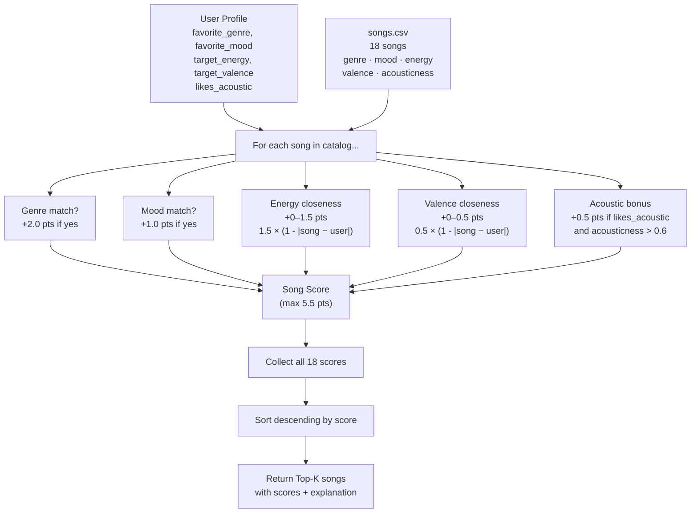

# 🎵 Music Recommender Simulation

## Project Summary

In this project you will build and explain a small music recommender system.

Your goal is to:

- Represent songs and a user "taste profile" as data
- Design a scoring rule that turns that data into recommendations
- Evaluate what your system gets right and wrong
- Reflect on how this mirrors real world AI recommenders

This version builds a content-based music recommender that scores songs from a 10-song catalog against a user's taste profile (genre, mood, energy preference, and acoustic preference). It ranks songs by a weighted similarity score and returns the top matches with a plain-language explanation of why each song was chosen.

---

## How The System Works

Real-world music recommenders like Spotify combine two strategies. **Collaborative filtering** finds patterns across millions of users ("people who liked X also liked Y"), while **content-based filtering** compares the actual attributes of songs — tempo, energy, mood, genre — against a user's known preferences. At scale, Spotify layers deep learning on top of raw audio to detect sonic similarity beyond what any single label captures. This simulator focuses on the content-based approach: it scores every song numerically against a user profile and returns the best matches.

### Data flow



### Song features used

Each `Song` object stores these attributes from `data/songs.csv`:

| Feature | Type | Role in scoring |
|---|---|---|
| `genre` | categorical | Flat +2.0 bonus on exact match — strongest signal |
| `mood` | categorical | Flat +1.0 bonus on exact match — second strongest |
| `energy` | float 0–1 | Closeness reward: up to +1.5 pts |
| `valence` | float 0–1 | Closeness reward: up to +0.5 pts |
| `acousticness` | float 0–1 | Binary bonus: +0.5 if user likes acoustic |
| `danceability`, `tempo_bpm` | float / int | Stored, available for future weighting |

### UserProfile stores

```python
user_prefs = {
    "genre": "lofi",        # categorical — exact match check
    "mood": "chill",         # categorical — exact match check
    "energy": 0.40,          # float 0–1 — reward closeness
    "valence": 0.60,         # float 0–1 — reward closeness
    "likes_acoustic": True,  # bool — enables acoustic bonus
}
```

### Algorithm Recipe (finalized)

```
score(song, user) =
    2.0  ×  (1 if song.genre == user.genre else 0)
  + 1.0  ×  (1 if song.mood  == user.mood  else 0)
  + 1.5  ×  (1 - |song.energy      - user.energy|)
  + 0.5  ×  (1 - |song.valence     - user.valence|)
  + 0.5  ×  (1 if user.likes_acoustic and song.acousticness > 0.6 else 0)
```

**Maximum possible score: 5.5**

The closeness formula `1 - |song_value - user_value|` rewards *similarity*, not just "higher is better" — a user wanting low-energy music (0.40) scores a calm song (0.35) much higher than a driving one (0.91).

### Ranking Rule

After scoring all 18 songs, the list is sorted in descending order and the top-k are returned. Scoring answers "how good is this one song?"; ranking answers "which songs do I actually show?" — two separate operations chained together.

### Known biases in this design

- **Genre dominance**: genre carries 2 of the 5.5 max points. A song can score 3.5 on energy + valence + acoustic alone, but genre match is still the single biggest swing. A great mood/energy match in the wrong genre will consistently rank below a mediocre same-genre song.
- **Mood is binary**: there is no partial credit for "relaxed" being close to "chill" — the system treats all mood mismatches equally.
- **Catalog skew**: the 18-song dataset over-represents lofi (3 songs) and pop (2). A lofi user will almost always get lofi songs back, not because the algorithm is wrong, but because there are more lofi options to choose from.
- **No history**: every run starts fresh with the same static profile. There is no learning from skips or replays.

---

## Getting Started

### Setup

1. Create a virtual environment (optional but recommended):

   ```bash
   python -m venv .venv
   source .venv/bin/activate      # Mac or Linux
   .venv\Scripts\activate         # Windows

2. Install dependencies

```bash
pip install -r requirements.txt
```

3. Run the app:

```bash
python -m src.main
```

### Running Tests

Run the starter tests with:

```bash
pytest
```

You can add more tests in `tests/test_recommender.py`.

---

## Experiments You Tried

Use this section to document the experiments you ran. For example:

- What happened when you changed the weight on genre from 2.0 to 0.5
- What happened when you added tempo or valence to the score
- How did your system behave for different types of users

---

## Limitations and Risks

Summarize some limitations of your recommender.

Examples:

- It only works on a tiny catalog
- It does not understand lyrics or language
- It might over favor one genre or mood

You will go deeper on this in your model card.

---

## Reflection

Read and complete `model_card.md`:

[**Model Card**](model_card.md)

Write 1 to 2 paragraphs here about what you learned:

- about how recommenders turn data into predictions
- about where bias or unfairness could show up in systems like this


---

## 7. `model_card_template.md`

Combines reflection and model card framing from the Module 3 guidance. :contentReference[oaicite:2]{index=2}  

```markdown
# 🎧 Model Card - Music Recommender Simulation

## 1. Model Name

Give your recommender a name, for example:

> VibeFinder 1.0

---

## 2. Intended Use

- What is this system trying to do
- Who is it for

Example:

> This model suggests 3 to 5 songs from a small catalog based on a user's preferred genre, mood, and energy level. It is for classroom exploration only, not for real users.

---

## 3. How It Works (Short Explanation)

Describe your scoring logic in plain language.

- What features of each song does it consider
- What information about the user does it use
- How does it turn those into a number

Try to avoid code in this section, treat it like an explanation to a non programmer.

---

## 4. Data

Describe your dataset.

- How many songs are in `data/songs.csv`
- Did you add or remove any songs
- What kinds of genres or moods are represented
- Whose taste does this data mostly reflect

---

## 5. Strengths

Where does your recommender work well

You can think about:
- Situations where the top results "felt right"
- Particular user profiles it served well
- Simplicity or transparency benefits

---

## 6. Limitations and Bias

Where does your recommender struggle

Some prompts:
- Does it ignore some genres or moods
- Does it treat all users as if they have the same taste shape
- Is it biased toward high energy or one genre by default
- How could this be unfair if used in a real product

---

## 7. Evaluation

How did you check your system

Examples:
- You tried multiple user profiles and wrote down whether the results matched your expectations
- You compared your simulation to what a real app like Spotify or YouTube tends to recommend
- You wrote tests for your scoring logic

You do not need a numeric metric, but if you used one, explain what it measures.

---

## 8. Future Work

If you had more time, how would you improve this recommender

Examples:

- Add support for multiple users and "group vibe" recommendations
- Balance diversity of songs instead of always picking the closest match
- Use more features, like tempo ranges or lyric themes

---

## 9. Personal Reflection

A few sentences about what you learned:

- What surprised you about how your system behaved
- How did building this change how you think about real music recommenders
- Where do you think human judgment still matters, even if the model seems "smart"

