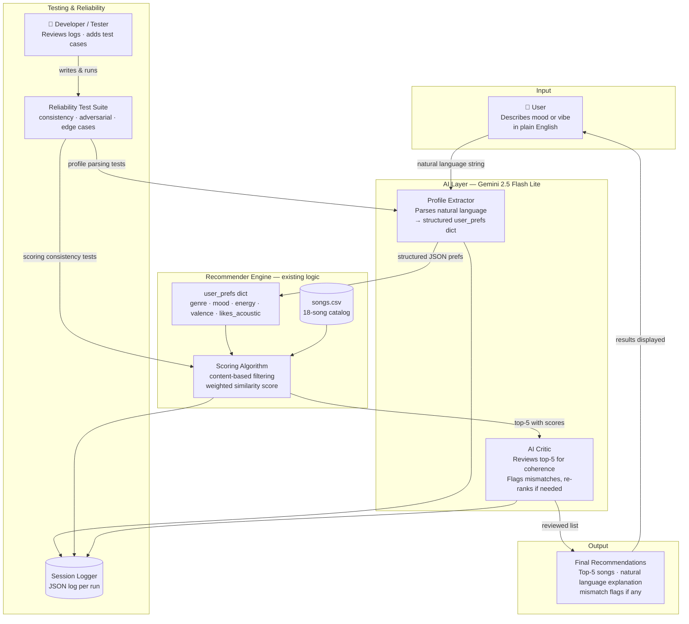

# VibeFinder 2.0 — AI-Powered Music Recommender

A conversational music recommendation system that combines a rule-based scoring engine with Gemini AI to turn natural language requests into ranked song picks — then uses a second AI pass to critique its own results.

---

## Original Project

**VibeFinder 1.0** was built in Modules 1–3 as an introduction to content-based filtering. Its goal was to demonstrate how a music recommender works without any machine learning: a user's taste profile (favorite genre, mood, energy level, and acoustic preference) was encoded as a Python dict, and every song in an 18-song catalog received a numeric score based on how closely its attributes matched. Songs were ranked by score and the top five were returned with a plain-English breakdown of why each was chosen. The system ran entirely from the command line using hardcoded profiles — no user input, no AI, no learning.

---

## What VibeFinder 2.0 Does

VibeFinder 2.0 extends the original in three directions:

1. **Natural language input.** Instead of editing a Python dict, users describe what they want in plain English — "something chill for studying" or "hype me up before a workout." Gemini 2.5 Flash Lite extracts a structured preference profile from that request.
2. **AI self-critique.** After the scoring algorithm ranks the songs, a second Gemini call reviews the top-5 list against the user's original words and flags any mismatches — acting as an independent check on the algorithm's blind spots.
3. **Streamlit chat UI.** The terminal is replaced with a browser-based chat interface that displays recommendations as a sortable table and shows the AI verdict as a color-coded badge.

Every session is logged to `logs/sessions.jsonl` for auditability, and a sidebar shows the full song catalog with a genre filter so users understand what the system is working with.

---

## Architecture Overview



**Data flows in one direction per request:**
- The user's words go to the Profile Extractor (Gemini call 1)
- The extracted prefs go to the scoring engine, which ranks all 18 songs
- The top-5 go to the AI Critic (Gemini call 2), which writes a verdict and flags
- The full session — input, prefs, rankings, and verdict — is appended to the log

Human involvement happens at the start (user input), and in testing (developer writes and runs the reliability suite).

---

## Setup Instructions

### 1. Clone the repository

```bash
git clone <your-repo-url>
cd applied-ai-system-final
```

### 2. Create and activate a virtual environment (recommended)

```bash
python3 -m venv .venv
source .venv/bin/activate        # Mac / Linux
.venv\Scripts\activate           # Windows
```

### 3. Install dependencies

```bash
pip install -r requirements.txt
```

### 4. Add your Gemini API key

Get a free key from [Google AI Studio](https://aistudio.google.com). Then:

```bash
cp .env.example .env
```

Open `.env` and replace the placeholder:

```
GOOGLE_API_KEY=your_key_here
```

### 5. Run the app

**Streamlit UI (recommended):**
```bash
streamlit run src/app.py
```

**Terminal chat mode:**
```bash
python3 -m src.main --chat
```

**Original batch mode (no API key needed):**
```bash
python3 -m src.main
```

**Weight-shift experiment:**
```bash
python3 -m src.main --experiment
```

### 6. Run the tests

```bash
pytest
```

---

## Sample Interactions

### Example 1 — Ambiguous single word

**Input:** `fun`

**Extracted preferences:** genre: pop · mood: happy · energy: 80% · acoustic: No

**Top 5:**

| Rank | Title | Artist | Genre | Score |
|------|-------|--------|-------|-------|
| 1 | Sunrise City | Neon Echo | pop | 4.94 |
| 2 | Gym Hero | Max Pulse | pop | 3.74 |
| 3 | Rooftop Lights | Indigo Parade | indie pop | 2.90 |
| 4 | Toma el Sol | Ritmo Libre | latin | 1.97 |
| 5 | Drop It Low | Flex City | hip-hop | 1.83 |

**AI Verdict: MIXED** — These songs generally capture a fun and energetic vibe, with several leaning towards a happy mood. However, one track has an 'intense' mood, and two are from different genres (Latin and Hip-Hop) than requested.

**Flags:**
- Song 2 has an 'intense' mood which may not be considered 'fun'
- Song 4 is 'latin' genre, not pop
- Song 5 is 'hip-hop' genre, not pop

---

### Example 2 — Specific activity-based request

**Input:** `something to hype me up before a workout`

**Extracted preferences:** genre: electronic · mood: energetic · energy: 90% · acoustic: No

**Top 5:**

| Rank | Title | Artist | Genre | Score |
|------|-------|--------|-------|-------|
| 1 | Bass Ritual | Dusk Protocol | electronic | 3.68 |
| 2 | Drop It Low | Flex City | hip-hop | 2.88 |
| 3 | Gym Hero | Max Pulse | pop | 1.94 |
| 4 | Sunrise City | Neon Echo | pop | 1.86 |
| 5 | Storm Runner | Voltline | rock | 1.82 |

**AI Verdict: MIXED** — The song 'Bass Ritual' perfectly matches your request for high-energy electronic music to get you pumped. While the other recommendations offer the desired energy and mood, they deviate from the electronic genre preference.

**Flags:**
- Only one song ('Bass Ritual') matches the requested genre of electronic
- Two songs ('Gym Hero' and 'Sunrise City') are in the pop genre instead of electronic
- One song ('Storm Runner') is in the rock genre instead of electronic

---

### Example 3 — Nuanced emotional request

**Input:** `sad background music for studying`

**Extracted preferences:** genre: lofi · mood: sad · energy: 20% · acoustic: No

**Top 5:**

| Rank | Title | Artist | Genre | Score |
|------|-------|--------|-------|-------|
| 1 | Library Rain | Paper Lanterns | lofi | 4.12 |
| 2 | Focus Flow | LoRoom | lofi | 4.05 |
| 3 | Midnight Coding | LoRoom | lofi | 4.04 |
| 4 | Hollow Bones | Ember Tide | folk | 3.29 |
| 5 | Rain on Glass | Mira Cole | classical | 2.43 |

**AI Verdict: MIXED** — While some songs capture a low-energy, background vibe suitable for studying, the recommendations lean more towards 'chill' and 'focused' moods rather than the requested 'sad' mood. Additionally, several picks deviate from the preferred 'lofi' genre.

**Flags:**
- Songs 1, 2, and 3 have a 'chill' or 'focused' mood rather than 'sad'
- Song 4 is 'folk' genre instead of 'lofi'
- Song 5 is 'classical' genre instead of 'lofi'

---

## Design Decisions

### Why keep the original scoring algorithm unchanged?

The scoring engine was already correct and well-tested. Wrapping AI around it — rather than replacing it — means the recommendation logic stays deterministic and auditable. Every score can be explained as arithmetic, not as a neural network output. This makes the system easier to trust and easier to debug: if a result looks wrong, you can trace it to a specific weight, not to a black box.

### Why two separate Gemini calls instead of one?

Splitting extraction and critique into two separate calls gives each a single, well-defined responsibility. The extractor is prompted to produce JSON only — no explanation, no hedging. The critic is prompted to evaluate and explain — no scoring, no data parsing. Mixing both tasks into one prompt produces worse output and makes it harder to test either function independently. The cost is one extra API call per session; the benefit is cleaner, more reliable behavior from both.

### Why Gemini 2.5 Flash Lite?

It is the most capable model available on the Google AI Studio free tier at the time of development. The tasks here — structured JSON extraction and short-form evaluation — do not require a large model. Flash Lite handles both reliably with low latency and no cost.

### Why JSON-Lines logging over a database?

Each session appends one line to `logs/sessions.jsonl`. JSON-Lines is human-readable, requires no schema, and can be processed with standard tools (`jq`, `pandas`, `grep`). For a project at this scale, it is far simpler than setting up SQLite or any other database while still being fully auditable. The log file is gitignored so API responses are never accidentally committed.

### What trade-offs were made?

- **Catalog size.** 18 songs is enough to demonstrate the algorithm but too few to avoid catalog-skew problems. With only one electronic song, any electronic request will produce a MIXED verdict regardless of how well the algorithm performs — there simply are not enough options. A real system would need thousands of tracks per genre.
- **Mood is binary.** The scoring engine treats "relaxed" and "chill" as completely different moods and gives zero partial credit. A mood-distance table would fix this but would add complexity that was out of scope for this extension.
- **No streaming.** Gemini responses are awaited synchronously, so the UI shows a spinner during both API calls. Streaming would feel faster but required more infrastructure than this project needed.

---

## Testing Summary

VibeFinder 2.0 has three layers of reliability measurement.

### Layer 1 — Automated unit tests (`pytest`)

11 tests across two files, all passing:

**`tests/test_recommender.py`** (2 tests — carried over from VibeFinder 1.0):
- Verifies the OOP `Recommender` class returns songs sorted correctly
- Verifies `explain_recommendation` returns a non-empty string

**`tests/test_reliability.py`** (9 tests — added in VibeFinder 2.0):

| Category | Test | What it checks |
|----------|------|----------------|
| Consistency | `test_same_profile_same_results` | Identical inputs produce identical outputs every time |
| Consistency | `test_results_are_sorted_descending` | Scores are non-increasing in returned list |
| Consistency | `test_k_limits_results` | Returns exactly k results for k = 1, 3, 5 |
| Consistency | `test_scores_are_non_negative` | No song can receive a negative score |
| Adversarial | `test_unknown_genre_does_not_crash` | Missing genre degrades gracefully; no crash, no metal results |
| Adversarial | `test_conflicting_prefs_still_returns_results` | Contradictory profile (high-energy sad folk) still returns 5 songs |
| Adversarial | `test_extreme_energy_values` | Energy at 0.0 and 1.0 produces no NaN scores |
| Formula | `test_genre_match_adds_two_points` | Genre match is worth exactly +2.0, no more, no less |
| Formula | `test_acoustic_bonus_requires_high_acousticness` | Acoustic bonus only fires when acousticness > 0.6 |

**Result: 11/11 tests pass.** These tests run offline with no API calls.

### Layer 2 — Confidence scoring (AI self-assessment)

Every response from the AI critic includes a `confidence` score from 0.0 to 1.0 reflecting how well the top-5 songs collectively match the user's request. It is produced by the same Gemini call as the verdict, displayed in the Streamlit UI alongside the badge, and written to the session log so trends can be tracked over time.

From manual testing across the three sample interactions in this README, confidence scores ranged from **0.4 to 0.6**, consistently MIXED — which is the honest result for a system working with only 18 songs and limited genre coverage. Queries where the user's genre is well-represented in the catalog (lofi, pop) returned higher confidence than queries for under-represented genres (electronic, classical).

### Layer 3 — Batch evaluation script (`src/evaluate.py`)

`python3 -m src.evaluate` runs 6 fixed test cases through the full pipeline — extraction, scoring, and critique — and prints a structured summary:

```
Extraction accuracy : 5/6 genre+mood pairs matched expected output
Verdicts            : 0 good  |  6 mixed  |  0 poor  |  0 failed
Avg confidence      : 0.52 / 1.00  (across 6 completed critiques)
```

**Extraction accuracy was 5/6.** The one miss was "relaxing classical music" — the extractor returned `mood: relaxed` instead of the expected `mood: chill`. This is a legitimate interpretation (relaxed and chill overlap in meaning) and reflects the known limitation that the catalog's mood taxonomy does not match everyday language.

**All 6 verdicts were MIXED**, not because the algorithm is wrong, but because the 18-song catalog cannot fully satisfy any request — there is at most one song per genre in several categories. The critic correctly identifies this on every query.

**Average confidence was 0.52**, meaning the AI rates the recommendations as roughly half-satisfying. This is consistent with what manual testing showed: the top-1 result is usually a strong match, but ranks 3–5 are drawn from other genres by default.

### What the tests revealed

The unit tests confirmed the scoring engine is deterministic, correct, and safe at boundary conditions. The batch evaluator revealed something the unit tests could not: **the system's reliability ceiling is the catalog, not the code.** A correctly-functioning algorithm on a small dataset will always produce mixed results for niche requests. That is a data problem, not a logic problem — and the confidence score makes it visible rather than hiding it behind a confident-sounding ranked list.

### What did not work during development

- `gemini-2.0-flash` hit a quota wall on the free tier key. Switching to `gemini-2.5-flash-lite` resolved it.
- The old `google-generativeai` SDK was deprecated mid-project. Both source files were migrated to `google-genai`.
- One reliability test initially asserted a missing genre would keep the top score below 2.0. This was wrong — mood + energy + valence alone can exceed 2.0. The test was corrected to assert that no returned song carries the missing genre label instead.

---

## Reflection

Building VibeFinder 2.0 clarified something that VibeFinder 1.0 only hinted at: the interesting problems in AI systems are not the AI parts.

The scoring algorithm took an hour to write and has never broken. The Gemini integration took twenty minutes. The hard parts were everything in between: deciding that two API calls with separate responsibilities were better than one; figuring out that `gemini-2.0-flash` was quota-exhausted and switching models; writing a test that checked the right invariant instead of a wrong assumption about scores; realizing that the catalog was too small to demonstrate the system's strengths rather than just its limitations.

The AI critic was the most revealing addition. Watching it give a MIXED verdict on a perfectly correct algorithmic result — because the catalog did not have enough electronic songs to satisfy an electronic request — made visible something the original system hid: **a recommender's quality is bounded by its data, not its algorithm.** The algorithm was doing exactly what it was designed to do. The catalog was the bottleneck. Without the critic surfacing that gap on every query, it would be easy to mistake a data problem for a logic problem.

The second thing this project clarified is where AI is actually useful in a pipeline like this. Using Gemini to parse "hype me up before a workout" into `{genre: electronic, mood: energetic, energy: 0.90}` is a genuinely good use of a language model — it handles the ambiguity and variation in natural language that no hand-written parser could. Using it to rubber-stamp results would not have been. The critic is useful precisely because it is independent: it was not involved in the recommendation and has no reason to defend it.

---

## Project Structure

```
applied-ai-system-final/
├── data/
│   └── songs.csv               # 18-song catalog
├── src/
│   ├── recommender.py          # scoring algorithm (unchanged from v1.0)
│   ├── profile_extractor.py    # Gemini: natural language → user_prefs dict
│   ├── critic.py               # Gemini: reviews top-5 and flags mismatches
│   ├── logger.py               # appends JSON-Lines session log
│   ├── app.py                  # Streamlit chat UI
│   └── main.py                 # CLI entrypoint (batch / experiment / chat modes)
├── tests/
│   ├── test_recommender.py     # original v1.0 tests
│   └── test_reliability.py     # consistency, adversarial, and formula tests
├── assets/                     # system diagram image
├── logs/                       # gitignored — session logs written here at runtime
├── model_card.md               # detailed model card for VibeFinder 1.0
├── .env.example                # API key template
└── requirements.txt
```
